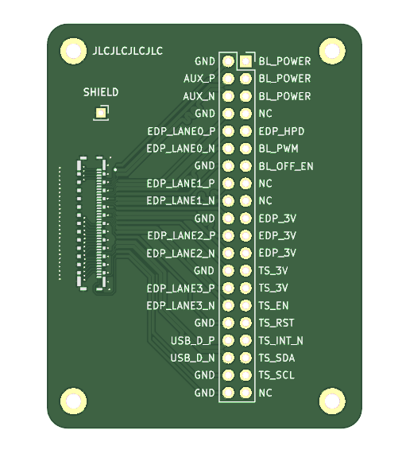
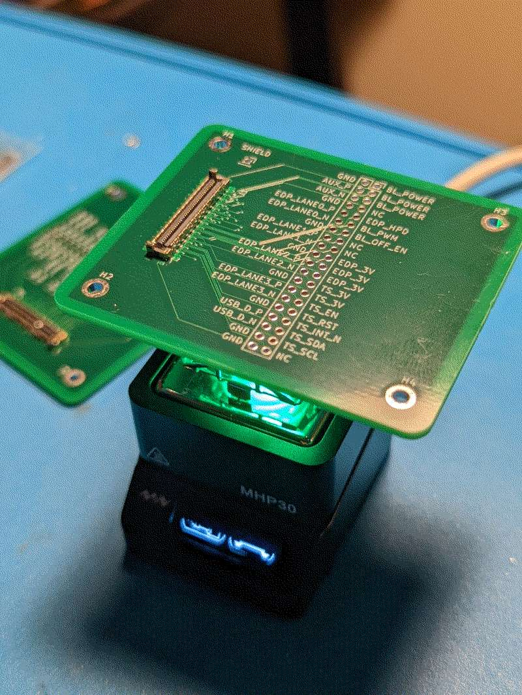

# Cabline-UM Breakout Board

This is a breakout board for the Framework Mainboard eDP connection via Cabline-UM 20879-040E-01.

This does not work with the standard Framework laptop cable that comes with the display kit.
The display kit seems to come with a cable that is on one half the cabline-um and on the other half is a cabline-vs
plug.

Instead, this breakout uses the Cabline-UM 20879-040E-01 to connect to the Framework mainboard, allowing you access
to all of the pins in a breakout.

Don't expect to be able to use it for reliable high-speed display-port connections but it may work for
basic prototypes or confirming the touchscreen.

## Fabrication

I've had decent luck getting this fabricated on JLCPCB - it was made with their limitations and tolerances in mind.

## Assembly Hints

If you can figure out how to assemble this by hand with a soldering iron please let me know how!  Most of the pins are hidden
behind a shield so the only way I was able to manage this was with a hot plate and solder paste.

## Bill of Materials

* [I-PEX 20879-040E-01](https://www.digikey.com/en/products/detail/i-pex/20879-040E-01/14312094)
* [A 40 Position Header Connector with 2.54mm pitch](https://www.digikey.com/en/products/detail/sullins-connector-solutions/PPTC202LFBN-RC/807240)
* [A Cabline-UM plug such as the 81466-100B-02-D](https://www.digikey.com/en/products/detail/i-pex/81466-100B-02-D/14312108)